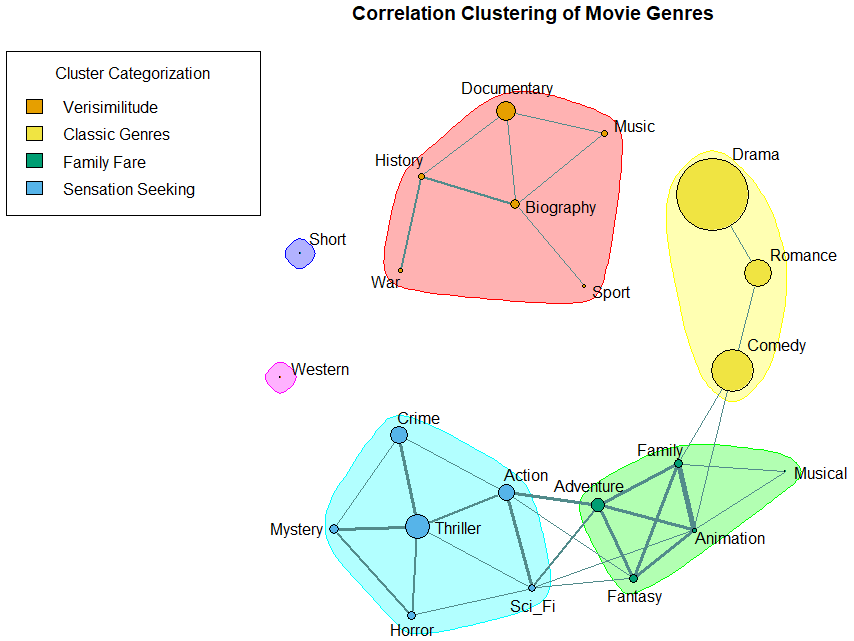

# 🎬 Market Trends & Genre Success: Analysis of 9,068 Films
[-blue)](https://doi.org/10.1016/j.poetic.2023.101839)
[]()
[]()

### **Project Overview**
This repository hosts the data pipeline and statistical analysis for a large-scale study on the film industry, examining the relationship between **production budgets**, **genre clusters**, and **market success** (box office & audience reception) over a 20-year period (1997–2017).

This project utilizes **longitudinal modeling** and **correlation network analysis** to identify how genres co-occur and evolve, providing a data-driven framework for predicting content success.

> **📄 Publication:**
> Francemone, C. J., Kryston, K., & Grizzard, M. (2023). Examining genre success, co-occurrence, release, and production of 9,068 films over twenty years. *Poetics, 99*, 1-13. https://doi.org/10.1016/j.poetic.2023.101794

### **Key Insights**
* **The Popcorn vs. Prestige Split:** Quantitative evidence that "Action" drives commercial popularity while "Drama" drives critical acclaim, with little overlap.
* **Genre Clusters:** Network analysis revealed 4 distinct production clusters (e.g., *Adventure/Animation/Family* tend to co-occur heavily), suggesting predictive bundles for studio greenlighting.
* **Seasonality:** Identified robust release windows where specific genres consistently outperform others (e.g., Sci-Fi in Summer vs. Documentary in Spring).

---

### **Repository Structure**
The project utilizes **SPSS** for statistical modeling (Regression/ANOVA) and **R** for correlation network visualization.

```text
/Market-Trends-and_Genre-Success-of-9-068-Films
│
├── /data
│   ├── Main_Data.csv              <-- The primary dataset (converted from SAV for accessibility)
│   ├── Genre_Over_Time_Data.csv   <-- Reworked dataset for time-series analysis
│   ├── Main_Data.sav              <-- Original .sav files (SPSS)
│   └── Genre_Over_Time_Data.sav              
│
├── /analysis_spss
│   ├── Main_Syntax.sps            <-- Syntax for main analyses
│   └── Genre_Over_Time_Syntax.sps <-- Syntax for longitudinal analyses
│
├── /visualization_r
│   ├── Genre_Network.Rmd          <-- R Markdown generating the co-occurrence network
│   └── Genre_Network_Viz.png      <-- Visualization of genre clusters
│
└── /results
    ├── Main_Results.Rmd           <-- Excel file containing main output
    └── Main_Results.xlsx          <-- Excel file containing longitudinal output
